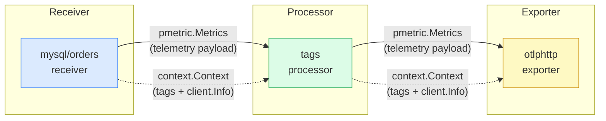
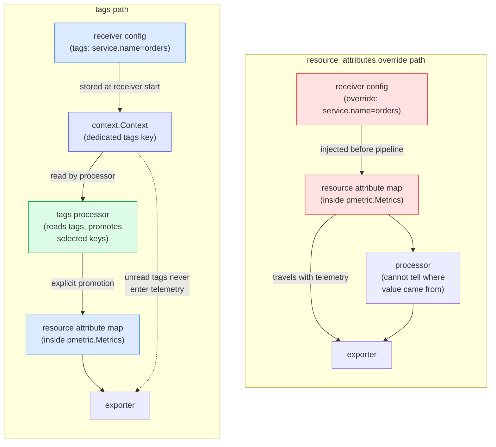
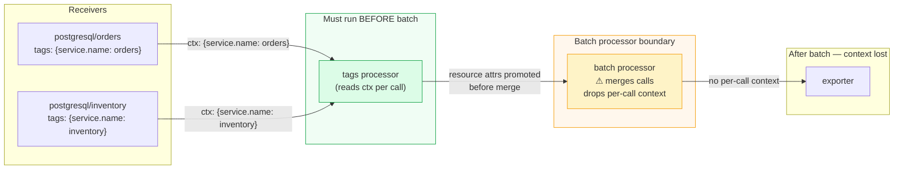

# Alternative approach for DBMON-1593: receiver tags

## Overview

DBMON-1593 proposes two things: auto-populating `service.name` from `db.system.name` per receiver, and a new `resource_attributes.override` field in the collector core. Both address a real gap. This document proposes an alternative that builds on the same goals and extends them further.

---

## The problem

There's no way in the OTel collector to declare static context alongside a receiver config block and have it available in the pipeline. Every receiver instance has a component ID (e.g. `receivertype/instancename`), but that ID never gets propagated into the telemetry stream. It's internal wiring only.

A user who wants to associate a specific receiver instance with a service name, a team, a cost center, or an environment has no clean option today.

---

## Options explored

### Existing collector primitives

Throughout this document, "processor" refers to an OTel pipeline processor — a component in the `processors:` stage of a collector pipeline, not DBMON-Processor.

- `resource` processor: a named instance per receiver, with a separate pipeline per receiver. Config grows linearly with receiver count.
- `transform` processor: `where` conditions keyed on receiver-emitted attribute values. Requires knowing each receiver type's internal attribute naming, and breaks when no suitable identity attribute exists.
- `OTEL_RESOURCE_ATTRIBUTES`: process-scoped, not receiver-scoped. Only works if you run one collector process per receiver.
- `lookupprocessor`: maps an emitted attribute value to k/v pairs via a YAML file, but only supports logs and requires an attribute-value key, not the component ID.

### DBMON-1593 proposals

- `resource_attributes.override`: a new field in the collector core that injects arbitrary resource attributes per receiver before the pipeline runs.
- Auto-populate `service.name` from `db.system.name`: set a default service name at the receiver level based on the database technology.

---

## Limitations of each approach

### Existing primitives

These tools weren't designed for this use case. None of them support declaring static context alongside a receiver config and having it available in the pipeline. Each requires either duplicating config per receiver, knowing receiver-internal attribute names, or running a separate collector process.

### `resource_attributes.override`

`override` solves the co-location problem and works for arbitrary attributes. The open question is provenance: once a value lands in the resource attribute map, downstream components can't distinguish it from receiver-emitted or processor-emitted attributes.

### Auto-populating `service.name` from `db.system.name`

The OTel spec defines `service.name` as user-assigned. A default derived from `db.system.name` just describes the technology, which is already what `db.system.name` is for. In backends that use `service.name` for entity identity, that default silently groups every instance of a given technology under the same service name.

NOTE that the receiver doesn't have access to the deployment context that other components do. The `resourcedetection` processor's `env` detector, Docker label detectors, and Kubernetes pod annotation detectors all have context the receiver can't see. The `hostmetricsreceiver` documents exactly this pattern: `export OTEL_RESOURCE_ATTRIBUTES="service.name=<your service>,service.namespace=<your namespace>,service.instance.id=<uuid>"`. The pipeline can pull from all of these, apply precedence rules, and do it consistently across every receiver type. A receiver-level default is set before any processor runs, which creates an ordering dependency for anything downstream that needs to set `service.name`.

### `service.instance.id` is different

Unlike `service.name`, the receiver is the only component that knows what endpoint it connected to. A survey of database receivers in this repo shows receiver-level auto-population of `service.instance.id` is inconsistent (see Appendix A). Single-endpoint receivers should follow the pattern already established by Oracle, PostgreSQL, MongoDB, and SQL Server: `enabled: true`, format left to each receiver's implementors. It doesn't matter whether it's an endpoint string or a UUID as long as it's unique and stable. The pipeline doesn't require consistency across receiver types, and anything that needs a different value can overwrite it downstream.

---

## Proposed solution: a `tags` block on receiver config

A flat `tags` block on any receiver config, handled by the collector core. Datadog agent checks, Prometheus scrape configs, and StatsD clients all support this: static key/value pairs declared alongside the source config, attached to every metric that source produces.

The config shape is a flat `map[string]string` on the receiver config struct. No schema, no per-receiver work, no changes to `metadata.yaml`:

```go
type ReceiverSettings struct {
    // existing fields...
    Tags map[string]string `mapstructure:"tags,omitempty"`
}
```

In practice:

```yaml
receivers:
  postgresql/orders:
    endpoint: orders-db.example.com:5432
    tags:
      service.name: orders
      deployment.environment: production
      team: payments

  postgresql/inventory:
    endpoint: inventory-db.example.com:5432
    tags:
      service.name: inventory
      deployment.environment: staging
      team: warehouse
```

The keys are whatever the user wants. No schema enforcement.

### Implementation: context side-channel

The pipeline looks like a pure data flow: only `pmetric.Metrics`, `plog.Logs`, or `ptrace.Traces` passes between components. A processor has no direct access to the config of the receiver that produced a batch.

There's already a side-channel for passing out-of-band data through the pipeline: `context.Context`. Every consumer interface takes the form `ConsumeMetrics(ctx context.Context, md pmetric.Metrics)`, and that `ctx` travels through every processor and exporter. The `go.opentelemetry.io/collector/client` package stores a `client.Info` struct at the receiver boundary with client IP, auth data, and request headers. The OIDC authenticator puts a `subject` in it. Multi-tenant routing processors key on tenant identity from it.

Receiver tags would use the same mechanism. When a receiver starts, the collector reads `Tags` from its config and stores them in a new context key before the first `ConsumeMetrics` call:

```go
// Collector core — set at receiver startup
ctx = receivertags.ContextWithTags(ctx, recv.Settings.Tags)

// In a processor
tags := receivertags.FromContext(ctx)
if svcName, ok := tags["service.name"]; ok {
    // promote to resource attribute
}
```

The context primitive is two functions:

```go
type tagsKey struct{}

func ContextWithTags(ctx context.Context, tags map[string]string) context.Context {
    return context.WithValue(ctx, tagsKey{}, tags)
}

func FromContext(ctx context.Context) map[string]string {
    tags, _ := ctx.Value(tagsKey{}).(map[string]string)
    return tags
}
```

No new structs. No schema. No changes to `metadata.yaml` or `pdata`.

Unlike values injected via `resource_attributes.override`, tags live on the context rather than the resource attribute map. A processor that reads them knows where they came from; one that doesn't read them is unaffected. They don't enter telemetry output unless something in the pipeline explicitly promotes them.

---

## Conclusion

| | `resource_attributes.override` | `tags` block |
|---|---|---|
| Requires per-receiver implementation | no | no |
| Works for arbitrary user-defined attributes | yes | yes |
| Co-located with receiver config | yes | yes |
| Scales to many receiver instances | yes | yes |
| Pipeline controls what enters telemetry | no | yes |
| Downstream components can identify origin | no | yes |
| Requires new collector core primitive | no | yes (new context key + field on ReceiverSettings) |
| Prior art in collector | no | yes (`receivercreator`) |
| Useful beyond `service.*` attributes | yes | yes |

The `tags` block requires minimal changes to the collector core: one field on `ReceiverSettings` and two context helper functions, with no changes to `metadata.yaml`, `pdata`, or any existing processor. It also fits naturally into patterns the collector already uses: `client.Info` for out-of-band context, `receivercreator` for receiver-level metadata injection. Promotion of tag values into telemetry is left to existing pipeline processors. That decision stays with the user configuring the pipeline, not the receiver.

Both `resource_attributes.override` and receiver tags require one addition to the collector core. The difference is where values end up. `override` puts them in the resource attribute map; tags go into a dedicated context key, the same pattern `client.Info` already uses for client IP, auth data, and request headers. Telemetry data stays untouched until a processor explicitly promotes tag values. Think of it like HTTP headers traveling with a request body: processors read and modify the headers, the body stays clean, and headers get stripped before the response leaves. The `receivercreator` already does receiver-level context injection for dynamically discovered endpoints; the `tags` block extends that to statically configured receivers.

RECOMMENDATION: This approach would supersede both `resource_attributes.override` and per-receiver `service.name` auto-population, but both could remain as transitional options while the `tags` primitive is established in the collector core. For `service.instance.id`, adopt the pattern already established across Oracle, PostgreSQL, MongoDB, and SQL Server: `enabled: true`, format left to each receiver's implementors.

---

## Appendix A: `service.instance.id` receiver survey

| Receiver | Source attribute | `service.instance.id` format |
|---|---|---|
| `oracledbreceiver` | DSN host + path | `host:port/serviceName` |
| `postgresqlreceiver` | `config.Endpoint` | `host:port` |
| `mongodbreceiver` | `server.address` + port | UUID v5 |
| `sqlserverreceiver` | `host.name` + port | `host:port` |
| `mysqlreceiver` | `mysql.instance.endpoint` | not set |
| `aerospikereceiver` | `aerospike.node.name` | not set |
| `couchdbreceiver` | `couchdb.node.name` | not set |
| `elasticsearchreceiver` | `elasticsearch.node.name` | not set |
| `memcachedreceiver` | `config.Endpoint` | not set |
| `mongodbatlasreceiver` | `mongodb_atlas.cluster.name` | not set |
| `redisreceiver` | `server.address` + `server.port` | not set |
| `riakreceiver` | `riak.node.name` | not set |
| `sqlqueryreceiver` | `config.DataSource` (DSN) | not set |

The receiver is the only component that knows what endpoint it connected to. NOTE that MongoDB derives a UUID v5 from `server.address` + port, which can't be reproduced in OpenTelemetry Transformation Language (OTTL) without custom logic. Receivers that don't set `service.instance.id` fall into two categories: multi-node by design (`mongodbatlasreceiver`, `elasticsearchreceiver`), or those that only expose a node/cluster name rather than a connectable endpoint.

---

## Appendix B: naming candidates for the `tags` field

The field name `tags` is a placeholder. The mechanism matters, the name doesn't. Other reasonable options:

- `labels`: familiar from Kubernetes, but carries selector semantics that don't apply here
- `annotations`: also from Kubernetes, semantically closer (arbitrary context on a resource)
- `context`: accurate, but collides with Go's `context.Context` in any technical discussion
- `attributes`: familiar in OTel, but already overloaded across resource, span, and metric maps
- `hints`: implies advisory intent, which isn't wrong
- `static_context`: accurate but wordy

`tags` is used here because it's the most widely understood term for flat user-supplied key/value pairs in monitoring tooling, with no conflicting meaning in the OTel model. The actual name is a decision for the collector maintainers.

---

## Appendix C: processor examples

A processor reads tags from context and promotes selected keys to resource attributes. One processor handles any number of receiver instances.

```go
// promote: copy all tags to resource attributes
func (p *tagsProcessor) ConsumeMetrics(ctx context.Context, md pmetric.Metrics) error {
    tags := receivertags.FromContext(ctx)
    if len(tags) > 0 {
        rms := md.ResourceMetrics()
        for i := 0; i < rms.Len(); i++ {
            attrs := rms.At(i).Resource().Attributes()
            for k, v := range tags {
                attrs.PutStr(k, v)
            }
        }
    }
    return p.next.ConsumeMetrics(ctx, md)
}

// add: inject a new key for downstream processors
func (p *enrichProcessor) ConsumeMetrics(ctx context.Context, md pmetric.Metrics) error {
    enriched := maps.Clone(receivertags.FromContext(ctx))
    enriched["processed_at"] = time.Now().Format(time.RFC3339)
    return p.next.ConsumeMetrics(receivertags.ContextWithTags(ctx, enriched), md)
}

// delete: remove a key before passing downstream
func (p *stripProcessor) ConsumeMetrics(ctx context.Context, md pmetric.Metrics) error {
    stripped := maps.Clone(receivertags.FromContext(ctx))
    delete(stripped, "cost_center")
    return p.next.ConsumeMetrics(receivertags.ContextWithTags(ctx, stripped), md)
}
```

NOTE: The batch processor merges calls from multiple upstream sources and drops the per-call context. Any processor that reads receiver tags must run before the batch processor. This is the same constraint that applies to `client.Info` and should be documented wherever context-reading processors are described.

```yaml
service:
  pipelines:
    metrics:
      receivers: [postgresql/orders, postgresql/inventory]
      processors:
        - resource/from_receiver_tags   # before batch
        - batch
      exporters: [otlphttp/backend]
```

---

## Appendix D: config comparison

The same goal — two PostgreSQL receivers, each tagged with a distinct service name and environment — expressed three ways. All options produce functionally identical output: the resulting telemetry events carry the same resource attributes. The differences are in config structure and where in the pipeline those values originate.

### Expected output

Both receiver instances produce resource attributes in this shape. The values differ per instance; the structure is the same regardless of which option was used to configure them.

`postgresql/orders`:
```json
{
  "resource": {
    "attributes": {
      "deployment.environment": "production",
      "postgresql.database.name": "orders",
      "service.instance.id": "orders-db.example.com:5432",
      "service.name": "orders"
    }
  }
}
```

`postgresql/inventory`:
```json
{
  "resource": {
    "attributes": {
      "deployment.environment": "staging",
      "postgresql.database.name": "inventory",
      "service.instance.id": "inventory-db.example.com:5432",
      "service.name": "inventory"
    }
  }
}
```

`service.instance.id` and `postgresql.database.name` are emitted by the receiver. `service.name` and `deployment.environment` are the attributes set by the config comparison below.

### Option 1: existing `resource` processor (no new primitives)

Every receiver needs its own named processor instance and its own pipeline. Config grows linearly: two receivers, two processors, two pipelines.

```yaml
receivers:
  postgresql/orders:
    endpoint: orders-db.example.com:5432
  postgresql/inventory:
    endpoint: inventory-db.example.com:5432

processors:
  resource/orders:
    attributes:
      - action: upsert
        key: service.name
        value: orders
      - action: upsert
        key: deployment.environment
        value: production
  resource/inventory:
    attributes:
      - action: upsert
        key: service.name
        value: inventory
      - action: upsert
        key: deployment.environment
        value: staging
  batch:

exporters:
  otlphttp/backend:
    endpoint: https://otel-backend.example.com

service:
  pipelines:
    metrics/orders:
      receivers: [postgresql/orders]
      processors: [resource/orders, batch]
      exporters: [otlphttp/backend]
    metrics/inventory:
      receivers: [postgresql/inventory]
      processors: [resource/inventory, batch]
      exporters: [otlphttp/backend]
```

### Option 2: `resource_attributes.override` (DBMON-1593 proposal)

Attributes are co-located with the receiver. One shared pipeline. The attributes land in the resource attribute map before the pipeline runs; downstream processors cannot tell where they came from.

```yaml
receivers:
  postgresql/orders:
    endpoint: orders-db.example.com:5432
    resource_attributes:
      override:
        service.name: orders
        deployment.environment: production
  postgresql/inventory:
    endpoint: inventory-db.example.com:5432
    resource_attributes:
      override:
        service.name: inventory
        deployment.environment: staging

processors:
  batch:

exporters:
  otlphttp/backend:
    endpoint: https://otel-backend.example.com

service:
  pipelines:
    metrics:
      receivers: [postgresql/orders, postgresql/inventory]
      processors: [batch]
      exporters: [otlphttp/backend]
```

### Option 3: `tags` block (this proposal)

Tags are co-located with the receiver. One shared pipeline. The tags travel on `context.Context` and only enter the resource attribute map when an upstream processor explicitly promotes them. Here the built-in `resource` processor reads from context rather than from a static value list, so one instance handles both receivers.

```yaml
receivers:
  postgresql/orders:
    endpoint: orders-db.example.com:5432
    tags:
      service.name: orders
      deployment.environment: production
  postgresql/inventory:
    endpoint: inventory-db.example.com:5432
    tags:
      service.name: inventory
      deployment.environment: staging

processors:
  resource/from_tags:   # one instance; reads context, not static values
    attributes:
      - action: upsert
        key: service.name
        from_context: receiver.tags.service.name   # this value is specific to the event instance, no repeated processor instances needed
      - action: upsert
        key: deployment.environment
        from_context: receiver.tags.deployment.environment

exporters:
  otlphttp/backend:
    endpoint: https://otel-backend.example.com

service:
  pipelines:
    metrics:
      receivers: [postgresql/orders, postgresql/inventory]
      processors: [resource/from_tags] # again, only one processor instance needed for all receivers
      exporters: [otlphttp/backend]
```

### Summary

| | `resource` processor | `resource_attributes.override` | `tags` block |
|---|---|---|---|
| Pipelines needed | one per receiver | one shared | one shared |
| Processor instances needed | one per receiver | none | one shared |
| Config lines scale with receiver count | yes | no | no |
| Attributes co-located with receiver | no | yes | yes |
| Attributes visible in telemetry immediately | yes | yes | only after promotion |
| Downstream can distinguish origin | no | no | yes |

---

## Appendix E: possible evolutions

The tags map on context is the minimal form. From here:

- A dedicated `tags` processor that handles promote, set, delete, and demote declaratively
- Tag-driven routing in connectors and exporters, without requiring promotion to resource attributes first
- Debug targeting: set a debug tag in context, act on it downstream, ship unmodified data to external systems
- Automatic stripping at export, with opt-in for forwarding selected keys to internal systems

---

## Appendix F: diagrams

### F.1: Pipeline data flow vs. context side-channel

The telemetry payload and the context travel in parallel. Processors can read or ignore the context without touching the payload.



### F.2: Where values end up — `resource_attributes.override` vs. `tags`

`override` injects values directly into the resource attribute map before the pipeline runs. Tags go into a dedicated context key and only reach the attribute map if a processor explicitly promotes them.



### F.3: Batch processor boundary

The batch processor merges calls from multiple receivers and drops per-call context. Any processor that reads receiver tags must run before it.


